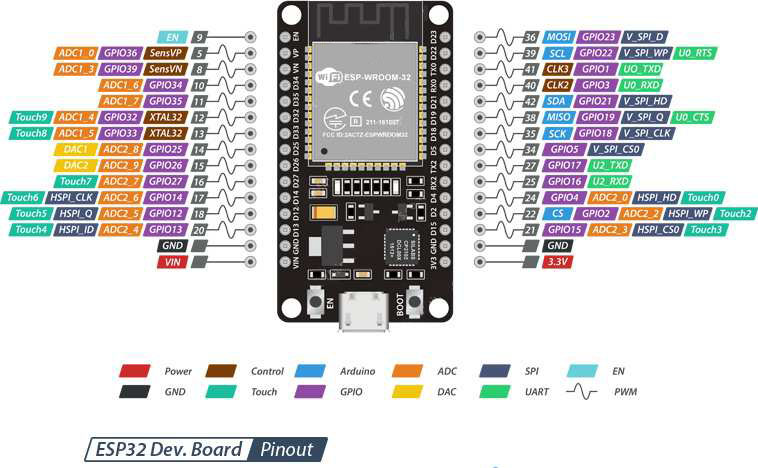
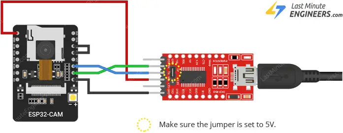
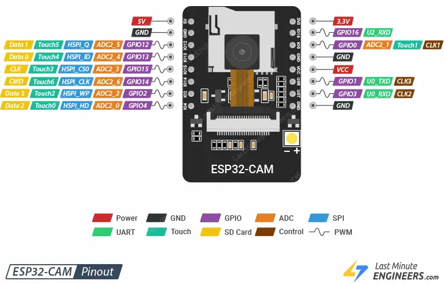

# README

## Read this to understand the project

- Differences between UART, I2C, and SPI -> [uart-i2c-spi.html](WikiFiles/Resources/uart-i2c-spi.html)
- Understanding the pinout of esp32 -> [understand-esp32-pinout.html](WikiFiles/Resources/understand-esp32-pinout.html)
- Programming the esp32 cam board -> [program-esp32cam.html](WikiFiles/Resources/program-esp32cam.html)

## Pinout of esp32 and esp32-cam boards

### esp32

### esp32-cam

